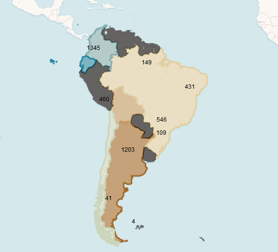
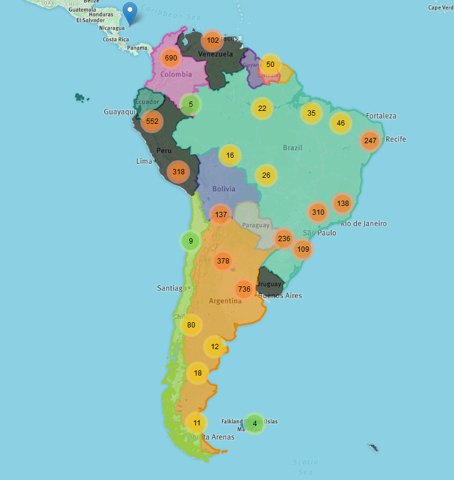
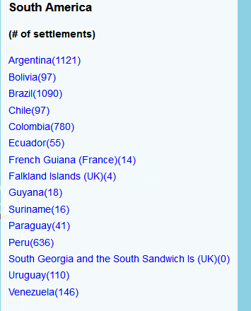

# map675-assignment04

Collaborative portion of Module-02

- adding point data from [Sedac](http://sedac.ciesin.columbia.edu/data/set/grump-v1-settlement-points-rev01/data-download) (interesting source: [free gis data](https://gisgeography.com/best-free-gis-data-sources-raster-vector/)) [SEDAC](http://sedac.ciesin.columbia.edu/downloads/data/grump-v1/grump-v1-settlement-points-rev01/grump-v1-settlement-points-rev01-shp.zipgrump-v1-settlement-points-rev01-shp.zip)

`mapshaper global_settlement_points_v1.01.shp -info`

I ran the following script outside of the scope of the _.git_ in order to avoid a commit with large files.

`mapshaper global_settlement_points_v1.01.shp -filter-fields Continent,Country,Name1,Year -split Continent -o format=geojson`

```english
[o] Wrote global_settlement_points_v1-Asia.json
[o] Wrote global_settlement_points_v1-Americas-South America.json
[o] Wrote global_settlement_points_v1-Americas-North America.json
[o] Wrote global_settlement_points_v1-Oceania.json
[o] Wrote global_settlement_points_v1-Europe.json
[o] Wrote global_settlement_points_v1-Africa.json
```

I then removed _*Continent*_ from the .json
`$ mapshaper data/global_settlement_points_v1-Americas-South-America.json -filter-fields Year,Name1,Country -o format=geojson`

The next set of data I searched for was polygon data from the following [website](https://tapiquen-sig.jimdo.com/english-version/free-downloads/south-america/).
> "Shape downloaded from [http://tapiquen-sig.jimdo.com](http://tapiquen-sig.jimdo.com). Carlos Efraín Porto Tapiquén. Orogénesis Soluciones Geográficas. Porlamar, Venezuela, 2015."

``` english
$ curl -LOk https://tapiquen-sig.jimdo.com/app/download/5497300559/South_America_Hydrography.rar?t=1484
592815
  0     0    0     0    0     0      0      0
100 11979  100 11979    0
```

Because this was a _.rar_ file I used `npm install node-unrar`.

The next command I used to create a new directory and create an _unrar.js_ file.
`$ cd ../ && mkdir scripts && touch unrar.js`

Which I created in the wrong directory just dragged and dropped it into the _scripts_ folder.

I tried making and _unrar.js_ script but couldn't get it to work correctly. I ended up downloading 7-zip to unarchive the .rar file.  Then I ran the following commands to convert to a _json_ and move to the _data_ directory.
`mapshaper project-files/South_America.shp -o format=geojson data/South-America.json`

## Styling

Lots of trial and error on styling South America polygons layer. Eventually, I added _project-files/South_America.shp_ to QGIS to add and `ID` field.

 ```english
 Attribute data
  Field    First value
  COUNTRY  'Argentina'
  ID       1
```



Finally got the marker clusters to show up once I added the _*.CSS*_

```  <link rel="stylesheet" href="libs/Leaflet.markercluster/MarkerCluster.Default.css"> />
  <link rel="stylesheet" href="libs/Leaflet.markercluster/MarkerCluster.css"> />
```

  

I totally missed the point of the lesson and the `bindData`.  To remedy this and given the time contraints,I added the `South-America.json` to QGIS and performed a `points to polygon` geoprocess so I could have a total number of points per polygon _number of settlements/country_. 
With the following code 
``` javascript
      for (var i = 0; i <= polygons.features.length - 1; i++) {
        var props = polygons.features[i].properties;
        legendList.append('<li class="legend-item" id="country ' + props.ID + '" ><a style="color:' + colors.Vivid[[10][i - 1]] + '" href="#">' + props.COUNTRY + '(<span>' + props.NUMPOINTS + '</span>)<a/></li>');

      }
```
I was able to appropriate populate the 
